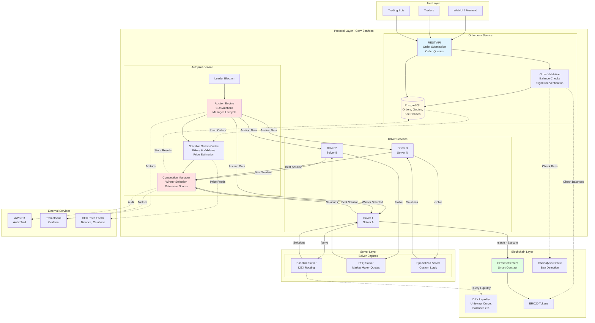
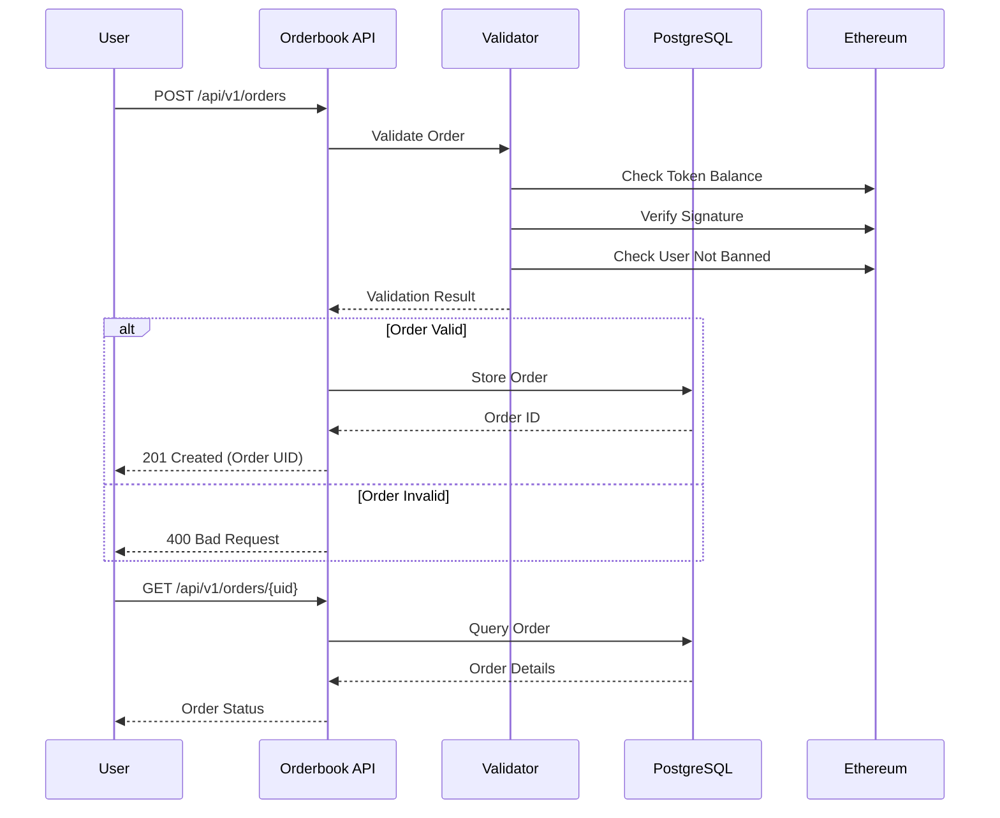
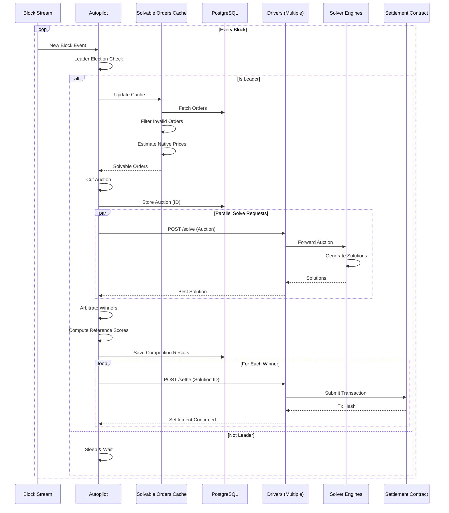
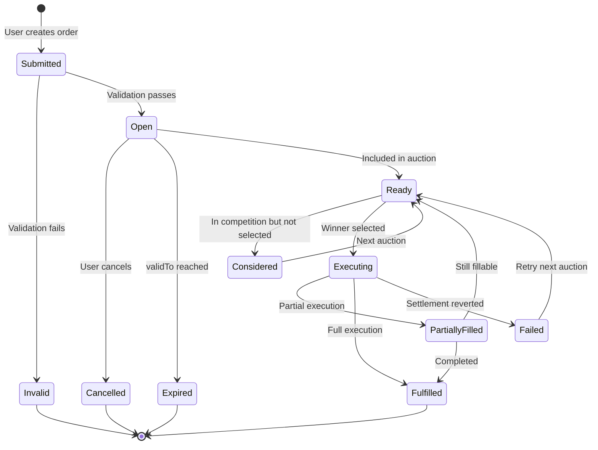
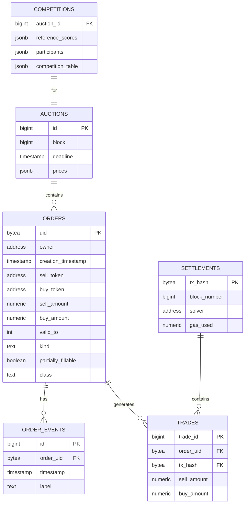
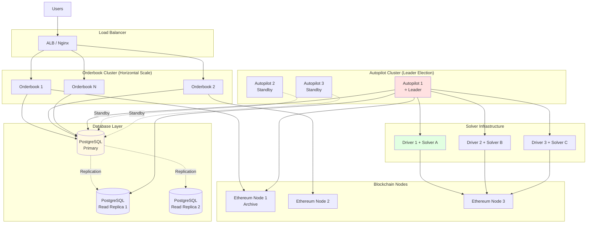
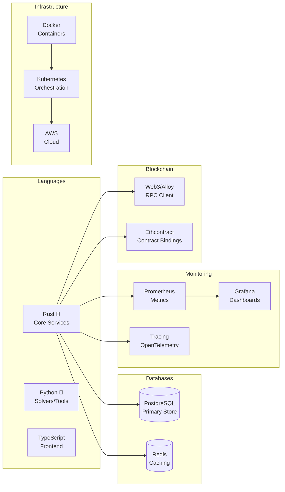
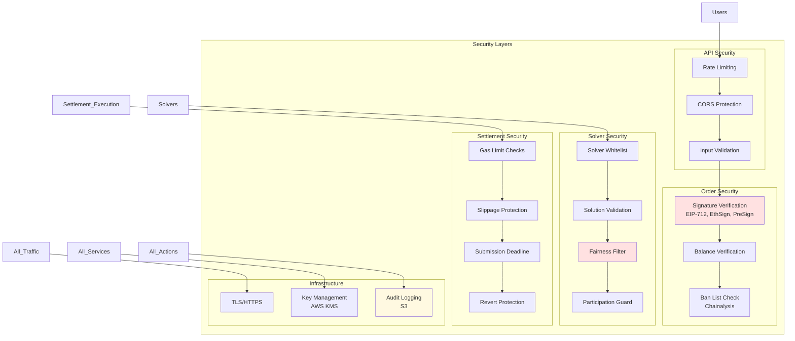

# CoW Protocol Services Architecture

## High-Level System Overview



---

## Detailed Component Architecture

### 1. Orderbook Service Flow



### 2. Autopilot Auction Cycle



### 3. Driver & Solver Engine Interaction

```mermaid
graph TB
    subgraph "Driver (Colocated with Solver)"
        subgraph "Driver Components"
            API[HTTP API<br/>/solve, /quote, /settle]
            Encoder[Settlement Encoder<br/>Converts to Calldata]
            Submitter[Transaction Submitter<br/>Gas Management<br/>MEV Protection]
            Liquidity[Liquidity Collector<br/>Uniswap, Balancer, etc.]
        end
        
        subgraph "Solver Engine (Your Code)"
            Logic[Solution Logic<br/>Path Finding<br/>Order Matching]
            Scorer[Score Calculator<br/>Surplus Optimization]
        end
    end

    subgraph "External"
        Autopilot[Autopilot]
        Settlement[Settlement Contract]
        DEX[DEX Protocols]
    end

    Autopilot -->|1. POST /solve| API
    API -->|2. Parse Auction| Logic
    
    Liquidity -.Fetch Pools.-> DEX
    Logic -.Query Liquidity.-> Liquidity
    
    Logic -->|3. Generate Solutions| Scorer
    Scorer -->|4. Best Solution| API
    API -->|5. Return Solution| Autopilot
    
    Autopilot -->|6. POST /settle<br/>(if winner)| API
    API -->|7. Encode Settlement| Encoder
    Encoder -->|8. Submit Tx| Submitter
    Submitter -->|9. Execute| Settlement

    style Logic fill:#ffe1e1
    style Scorer fill:#ffe1e1
    style API fill:#e1f5ff
    style Settlement fill:#e1ffe1
```

---

## Data Flow Architecture

### Order Lifecycle State Machine



### Database Schema Overview



---

## Network Architecture

### Production Deployment



---

## Component Responsibilities Matrix

| Component | Responsibilities | Scalability | State |
|-----------|-----------------|-------------|-------|
| **Orderbook** | • Order submission<br/>• Order queries<br/>• Fee estimation<br/>• Quote generation | Horizontal (stateless) | Shared DB |
| **Autopilot** | • Auction creation<br/>• Solver coordination<br/>• Winner selection<br/>• Settlement triggering | Single leader (HA standby) | Shared DB + In-memory cache |
| **Driver** | • Liquidity collection<br/>• Solution encoding<br/>• Transaction submission<br/>• Gas optimization | One per solver | Local state |
| **Solver Engine** | • Solution generation<br/>• Route finding<br/>• Order matching | Independent | Stateless |
| **PostgreSQL** | • Order persistence<br/>• Auction history<br/>• Competition results | Primary + Replicas | Persistent |
| **S3** | • Audit trail<br/>• Competition data<br/>• Analytics | Infinite | Persistent |

---

## Key Integration Points

### 1. User → Protocol

```
User Application
    ↓ HTTPS
Orderbook API (:8080)
    ↓ SQL
PostgreSQL Database
```

### 2. Autopilot → Solvers

```
Autopilot
    ↓ HTTP POST /solve
Driver (:9000)
    ↓ HTTP POST /solve
Solver Engine (:8080)
    ↓ Solution
Driver
    ↓ Best Solution
Autopilot
```

### 3. Settlement → Blockchain

```
Driver
    ↓ eth_sendRawTransaction
Ethereum Node
    ↓ Transaction
Settlement Contract
    ↓ Token Transfers
User Wallets
```

---

## Technology Stack Summary



---

## Performance Characteristics

| Metric | Target | Notes |
|--------|--------|-------|
| **Order Submission** | < 100ms | API response time |
| **Order Validation** | < 500ms | Including blockchain checks |
| **Auction Creation** | 1-3s | Per block |
| **Solver Deadline** | 10-30s | Configurable |
| **Winner Selection** | < 500ms | Arbitration algorithm |
| **Settlement Time** | 12s (1 block) | Ethereum block time |
| **Orders per Auction** | 100-1000+ | Depends on complexity |
| **Concurrent Solvers** | 10-20+ | Parallel execution |

---

## Security Architecture



---

## Summary

**CoW Protocol Services** is a sophisticated multi-component system that:

1. **Collects orders** from users via a horizontally scalable REST API
2. **Validates** orders against blockchain state and ban lists
3. **Creates auctions** periodically (every block) containing solvable orders
4. **Coordinates** a competition between multiple independent solvers
5. **Selects winners** based on surplus maximization and fairness constraints
6. **Executes settlements** on-chain via the GPv2Settlement contract
7. **Maintains** a complete audit trail and analytics in PostgreSQL and S3

The architecture is designed for:
- ✅ **High availability** (leader election, horizontal scaling)
- ✅ **Performance** (caching, parallel processing)
- ✅ **Security** (signature verification, solution validation)
- ✅ **Fairness** (uniform clearing prices, reference scores)
- ✅ **Extensibility** (pluggable solvers, configurable strategies)
