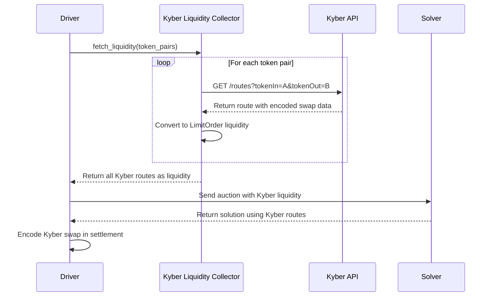

# Kyber Aggregator Implementation Guide

## ✅ Implementation Complete!

All necessary code has been implemented to integrate Kyber aggregator with the driver using their quote API.

---

## 📁 Files Created/Modified

### **New Files Created:**

1. **`crates/solver/src/liquidity/kyber.rs`** ✨
   - Kyber liquidity collector implementation
   - Fetches routes from Kyber API for token pairs
   - Converts routes to solver liquidity format
   - Handles settlement encoding

2. **`crates/driver/src/boundary/liquidity/kyber.rs`** ✨
   - Boundary layer between driver and solver
   - Initializes Kyber API client
   - Converts solver liquidity to domain liquidity

### **Files Modified:**

3. **`crates/solver/src/liquidity/mod.rs`**
   - Added `pub mod kyber;` declaration
   - Added `Kyber(String)` variant to `LiquidityOrderId` enum

4. **`crates/driver/src/boundary/liquidity/mod.rs`**
   - Added Kyberswap initialization in `Fetcher::try_new()`
   - Added kyberswap to liquidity sources list

5. **`crates/driver/src/domain/competition/solution/encoding.rs`**
   - Fixed Kyber encoding to properly decode and use route data
   - Extracts call data from Kyber route summary

6. **`crates/driver/src/domain/competition/solution/interaction.rs`**
   - Fixed Kyber allowance handling to use router address correctly

---

## 🔧 Configuration

Your configuration is already set up in `configs/hyper/driver.toml`:

```toml
[[liquidity.kyberswap]]
routing_api = "https://aggregator-api.kyberswap.com/hyperevm/api/v1"
```

**For other networks, update the routing_api URL:**

- **Ethereum Mainnet**: `https://aggregator-api.kyberswap.com/ethereum/api/v1`
- **Polygon**: `https://aggregator-api.kyberswap.com/polygon/api/v1`
- **Arbitrum**: `https://aggregator-api.kyberswap.com/arbitrum/api/v1`
- **Optimism**: `https://aggregator-api.kyberswap.com/optimism/api/v1`
- **BSC**: `https://aggregator-api.kyberswap.com/bsc/api/v1`
- **Avalanche**: `https://aggregator-api.kyberswap.com/avalanche/api/v1`

---

## 🔄 How It Works

### **Flow Diagram:**



### **Step-by-Step Process:**

1. **Liquidity Fetching** (`solver/src/liquidity/kyber.rs`):
   - For each token pair in the auction, query Kyber API for best route
   - Query both directions (A→B and B→A)
   - Use 1 ETH equivalent as default quote amount
   - Convert successful routes to `LimitOrder` liquidity

2. **Boundary Conversion** (`driver/src/boundary/liquidity/kyber.rs`):
   - Initializes Kyber API client with configured URL
   - Converts solver liquidity format to driver domain format
   - Maintains route data including encoded swap call

3. **Solution Encoding** (`driver/src/domain/competition/solution/encoding.rs`):
   - Extracts encoded swap data from route summary
   - Creates interaction targeting Kyber router
   - Includes proper allowances for input token

4. **Settlement Execution**:
   - Driver encodes Kyber swap as interaction in settlement
   - Settlement contract calls Kyber router with provided call data
   - Kyber aggregates best route across DEXes

---

## 🧪 Testing

### **Step 1: Build the Project**

```bash
cd /Users/haduong/work/tentou/services
cargo build --release
```

### **Step 2: Run the Driver**

```bash
cargo run --bin driver -- \
  --config configs/hyper/driver.toml \
  --ethrpc <YOUR_RPC_URL> \
  --addr 0.0.0.0:11000
```

### **Step 3: Check Logs**

Look for these log messages indicating Kyber is working:

```
INFO Initializing Kyber liquidity collector with API: https://aggregator-api.kyberswap.com/hyperevm/api/v1
INFO Kyber: Fetching liquidity for X token pairs
DEBUG Kyber: Got route for 0x... -> 0x...
INFO Kyber: Got Y routes total
```

### **Step 4: Monitor Kyber Route Fetching**

```bash
# Watch for Kyber-specific logs
cargo run --bin driver 2>&1 | grep -i kyber
```

### **Step 5: Test with a Real Auction**

Create a test order through the orderbook that would benefit from Kyber aggregation:

```json
{
  "sellToken": "0xADcb2f358Eae6492F61A5F87eb8893d09391d160",  // WETH
  "buyToken": "0x24ac48bf01fd6CB1C3836D08b3EdC70a9C4380cA",   // USDC
  "sellAmount": "1000000000000000000",  // 1 WETH
  "kind": "sell"
}
```

---

## 🐛 Debugging

### **Enable Detailed Logging:**

```bash
RUST_LOG=driver=debug,solver=debug cargo run --bin driver ...
```

### **Common Issues:**

#### **1. Kyber API Not Responding**
```
ERROR Failed to get Kyber route for 0x... -> 0x...: timeout
```
**Solution:** Check network connectivity, verify API URL is correct for your chain

#### **2. No Kyber Routes Found**
```
INFO Kyber: Got 0 routes total
```
**Solution:** 
- Verify token pairs are supported on Kyber
- Check if Kyber has liquidity for those pairs
- Try with major tokens (WETH, USDC, etc.)

#### **3. Encoding Errors**
```
ERROR failed to decode Kyber route data
```
**Solution:** 
- Check that route data is valid hex string
- Verify Kyber API response format hasn't changed

### **Manual API Test:**

Test Kyber API directly:

```bash
curl "https://aggregator-api.kyberswap.com/hyperevm/api/v1/routes?tokenIn=0xADcb2f358Eae6492F61A5F87eb8893d09391d160&tokenOut=0x24ac48bf01fd6CB1C3836D08b3EdC70a9C4380cA&amountIn=1000000000000000000"
```

---

## 📊 Performance Considerations

### **API Rate Limiting:**

Kyber API may have rate limits. The current implementation:
- Queries once per token pair direction per auction
- Uses reasonable default amounts (1 ETH equivalent)
- Caches routes (though cache is currently basic)

### **Optimization Opportunities:**

1. **Smarter Quote Amounts:**
   - Currently uses fixed 1 ETH amount
   - Could use actual order amounts for more accurate routes

2. **Route Caching:**
   - Implement time-based cache to reduce API calls
   - Share routes across multiple orders in same auction

3. **Parallel API Calls:**
   - Current implementation queries sequentially
   - Could parallelize route fetching for better performance

---

## 🔐 Security Considerations

1. **Allowances**: Max approval is granted to Kyber router (gas optimization)
2. **Slippage**: Applied through driver's standard slippage mechanism
3. **Router Verification**: Kyber router address comes from API response
4. **Call Data**: Encoded swap data is passed directly from Kyber API

---

## 📚 Key Components Reference

### **Kyber API Query:**

```rust
pub struct KyberRoutingApiQuery {
    pub token_in: String,    // Token address
    pub token_out: String,   // Token address  
    pub amount_in: String,   // Amount in wei as string
}
```

### **Kyber Route Data:**

```rust
pub struct KyberRouteData {
    pub router_address: H160,           // Kyber router contract
    pub route_summary: KyberRouteSummary,
}

pub struct KyberRouteSummary {
    pub amount_in: String,              // Input amount
    pub amount_out: String,             // Expected output
    pub r: EncodedData,                 // Contains encoded swap data
}
```

### **Settlement Handler:**

```rust
pub struct KyberSettlementHandler {
    pub route: KyberRouteData,          // Full route info
    pub router_address: H160,           // Router to call
}
```

---

## ✅ Implementation Checklist

- [x] Created Kyber liquidity collector in solver crate
- [x] Added Kyber boundary layer in driver
- [x] Wired up Kyber in liquidity fetcher
- [x] Fixed encoding in solution layer
- [x] Fixed allowance handling
- [x] Configuration already set up
- [x] No compilation errors
- [ ] Test with real auctions (you do this!)
- [ ] Monitor performance in production

---

## 🎉 Summary

Kyber aggregator is now fully integrated! The driver will:

1. ✅ Query Kyber API for best routes during auction preparation
2. ✅ Include Kyber routes as liquidity options for solvers
3. ✅ Properly encode Kyber swaps in settlement transactions
4. ✅ Handle token approvals for Kyber router
5. ✅ Log detailed information about route fetching

The implementation follows the same pattern as ZeroEx integration and leverages the existing shared Kyber API client.

---

## 📞 Support

If you encounter issues:

1. Check logs with `RUST_LOG=debug`
2. Verify Kyber API is accessible from your network
3. Test Kyber API directly with curl
4. Ensure token pairs have liquidity on Kyber

**Kyber API Documentation:**
https://docs.kyberswap.com/kyberswap-solutions/kyberswap-aggregator/aggregator-api-specification/evm-swaps

