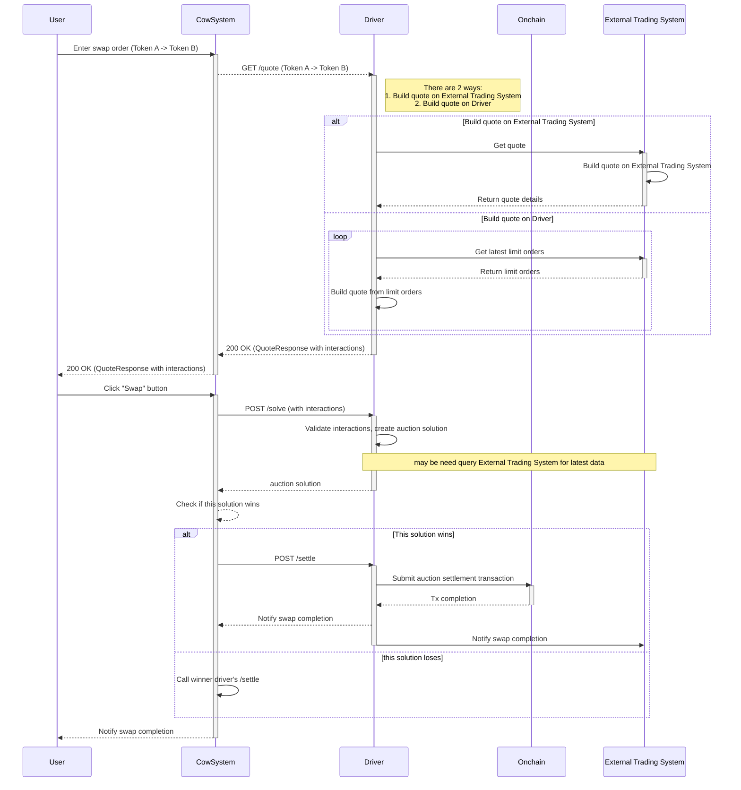

# Integrating a Trading System with Driver-Hyperliquid-Template

This guide explains how to integrate an external trading system, particularly one that utilizes a central `vault` contract for token transfers, with the `driver-hyperliquid-template`.

## Core Concept: Vault-based Swaps

In this integration model, the `vault` contract acts as an intermediary for token swaps. When a user wants to swap Token A for Token B, the process involves two main interactions:

1.  **User to Vault**: The user transfers the `sellToken` (Token A) to the `vault` contract.
2.  **Vault to User**: The `vault` contract then transfers the `buyToken` (Token B) to the user.

This design centralizes liquidity management within the `vault`, simplifying the solver's role in executing trades.

## API Integration Flow

### 1. Getting a Quote (`/quote` endpoint)

When the `driver-hyperliquid-template` receives a `GET /quote` request for a swap (e.g., Token A -> Token B):

-   The driver will internally query the external trading system (e.g., Hyperliquid) to determine the optimal `buyAmount` for a given `sellAmount` (or vice-versa).
-   The response from the external trading system will be used to construct the `QuoteResponseKind`.
-   Crucially, the `interactions` field within the `QuoteResponse` will describe the necessary on-chain steps for the swap. For a vault-based system, these interactions will typically look like this:
    -   **Interaction 1 (User to Vault)**:
        -   `target`: Address of the `sellToken` (Token A) contract.
        -   `value`: `0` (for ERC20 transfers).
        -   `callData`: Encoded `transferFrom` call to move `sellAmount` of Token A from the user to the `vault`.
    -   **Interaction 2 (Vault to User)**:
        -   `target`: Address of the `buyToken` (Token B) contract.
        -   `value`: `0` (for ERC20 transfers).
        -   `callData`: Encoded `transfer` call to move `buyAmount` of Token B from the `vault` to the user.

    The `solver` field in the `QuoteResponse` should be the address of the `vault` contract, as it is the entity performing the actual token transfer to the user.

### 2. Executing a Swap (`/solve` endpoint)

After a quote is received and accepted, the `driver-hyperliquid-template` might receive a `POST /solve` request containing the `SolveRequest` body. This body will include the `orders` and `tokens` relevant to the auction.

-   The `SolveRequest` will contain the `interactions` that were previously generated during the quoting phase.
-   When the `solve` endpoint is called with these interactions, the driver is expected to:
    -   Verify the validity of the proposed solution (e.g., check prices, amounts, and interactions against current market conditions).
    -   If the solution is valid and wins the competition, the driver will then proceed to execute the swap by submitting a transaction that performs the described `interactions` on-chain.
    -   This means the `vault` contract will be called to facilitate the token transfers as specified in the `interactions`.

### Example `QuoteResponse` (Conceptual)

```json
{
  "clearingPrices": {},
  "preInteractions": [],
  "interactions": [
    {
      "target": "0x...[Token A Address]...",
      "value": "0",
      "callData": "0x...[transferFrom(user, vault, amountA)]..."
    },
    {
      "target": "0x...[Token B Address]...",
      "value": "0",
      "callData": "0x...[transfer(user, amountB)]..."
    }
  ],
  "solver": "0x...[Vault Contract Address]...",
  "gas": 100000,
  "txOrigin": "0x...[User Address]...",
  "jitOrders": []
}
```

By following this pattern, the `driver-hyperliquid-template` can effectively integrate with external trading systems that rely on a `vault` for secure and efficient token swaps.

## Sequence Diagram


