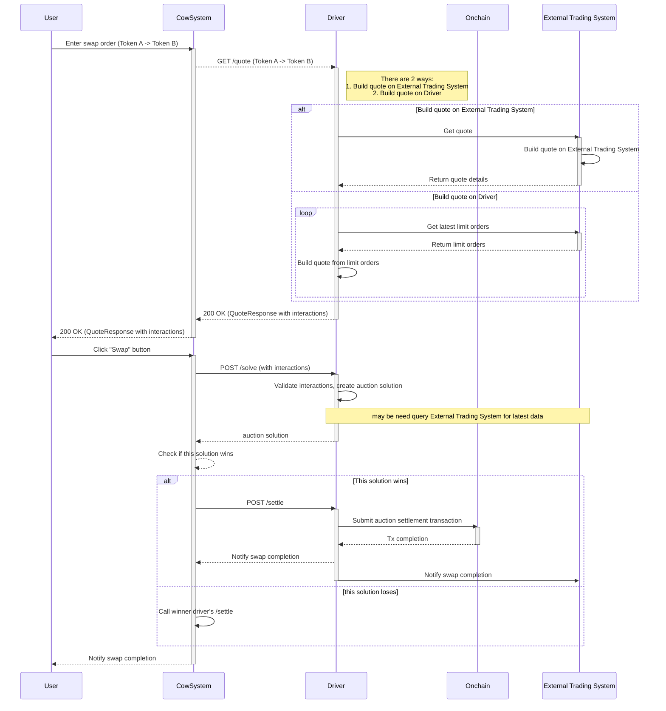

# Integrating a Trading System with Driver-Hyperliquid-Template

This guide explains how to integrate an external trading system, particularly one that utilizes a central `vault` contract for token transfers, with the `driver-hyperliquid-template`.

## Core Concept: Vault-based Swaps

In this integration model, the `vault` contract acts as a central intermediary for token swaps. The `driver-hyperliquid-template`, acting as a solver, is responsible for constructing the necessary on-chain `interactions` that utilize this `vault` for token transfers.

When a user wants to swap Token A for Token B, the solver's proposed solution, executed via the settlement contract, will orchestrate two main types of interactions involving the `vault`:

1.  **User to Vault (Sell Token)**: The user first grants approval to the `vault` contract (or the settlement contract, which then calls the vault) to spend their `sellToken` (Token A). The `vault` then pulls the `sellAmount` of Token A from the user.
2.  **Vault to User (Buy Token)**: The `vault` contract then transfers the `buyAmount` of `buyToken` (Token B) to the user.

This design centralizes liquidity management and execution within the `vault`, simplifying the on-chain logic for individual trades and allowing the solver to focus on optimal order matching and interaction construction. These vault-based interactions are generated during the `/quote` phase and ultimately executed during the `/settle` phase.

## API Integration Flow

### 1. Getting a Quote (`GET /quote`)

This endpoint is used to obtain a price estimation for a potential trade.

When the `driver-hyperliquid-template` receives a `GET /quote` request, it expects the following query parameters: `sellToken`, `buyToken`, `kind` (buy/sell), `amount`, and `deadline`.

-   The driver will internally query the external trading system (e.g., Hyperliquid) to determine the optimal `buyAmount` for a given `sellAmount` (or vice-versa) based on the requested `kind` and `amount`.
-   The response from the external trading system will be used to construct the `QuoteResponseKind`.
-   Crucially, the `interactions` field within the `QuoteResponse` will describe the necessary on-chain steps for the swap. For a vault-based system, these interactions will typically look like this:
    -   **Interaction 1 (User to Vault)**:
        -   `target`: Address of the `sellToken` (Token A) contract.
        -   `value`: `0` (for ERC20 transfers).
        -   `callData`: Encoded `transferFrom` call to move `sellAmount` of Token A from the user to the `vault`.
    -   **Interaction 2 (Vault to User)**:
        -   `target`: Address of the `buyToken` (Token B) contract.
        -   `value`: `0` (for ERC20 transfers).
        -   `callData`: Encoded `transfer` call to move `buyAmount` of Token B from the `vault` to the user.

    The `solver` field in the `QuoteResponse` should be the address of the `vault` contract, as it is the entity performing the actual token transfer to the user. The `gas` field will provide an estimated gas cost for the trade.

### 2. Solving an Auction (`POST /solve`)

This endpoint is called by Autopilot to find the optimal settlement solution for a given auction. It does not execute the trade directly but proposes a solution.

When the `driver-hyperliquid-template` receives a `POST /solve` request, the `SolveRequest` body will contain:

-   `id`: A unique identifier for the auction.
-   `orders`: A list of solvable orders included in the auction.
-   `tokens`: Information about the tokens involved in the auction.
-   `deadline`: The time by which the solver is expected to respond.

-   The driver, acting as a solver, will process these orders and tokens, potentially querying the external trading system for the latest market data.
-   It will then determine the best way to match and settle these orders, aiming to maximize the objective value (e.g., user surplus).
-   The response will be a `SolveResponse`, which includes one or more `solutions`. Each solution will have a `solutionId`, a `score` (objective value), and details about how orders are executed (e.g., `executedSell`, `executedBuy`). Crucially, this response *does not* contain the calldata for on-chain execution; it only indicates the solver's proposed outcome.

### Example `QuoteResponse` (Conceptual)

```json
{
  "clearingPrices": {},
  "preInteractions": [],
  "interactions": [
    {
      "target": "0x...[Token A Address]...",
      "value": "0",
      "callData": "0x...[transferFrom(user, vault, amountA)]..."
    },
    {
      "target": "0x...[Token B Address]...",
      "value": "0",
      "callData": "0x...[transfer(user, amountB)]..."
    }
  ],
  "solver": "0x...[Vault Contract Address]...",
  "gas": 100000,
  "txOrigin": "0x...[User Address]...",
  "jitOrders": []
}
```

### 3. Settling an Auction (`POST /settle`)

This endpoint is called by Autopilot to instruct the solver to execute a previously found solution on-chain.

When the `driver-hyperliquid-template` receives a `POST /settle` request, the `SettleRequest` body will contain:

-   `solutionId`: The unique identifier of the solution to be executed, which was previously returned by the `/solve` endpoint.
-   `submissionDeadlineLatestBlock`: The last block number in which the solution transaction can be included.
-   `auctionId`: The ID of the auction in which the specified solution is competing.

-   Upon receiving this request, the driver is expected to immediately submit the transaction to the blockchain that performs the on-chain `interactions` associated with the `solutionId`.
-   This action finalizes the swap, transferring tokens via the `vault` contract as described in the solution.

By following this pattern, the `driver-hyperliquid-template` can effectively integrate with external trading systems that rely on a `vault` for secure and efficient token swaps.

## Sequence Diagram
### Overview



## HyperLiquid Solution Generator Implementation (`hyperliquid.rs`)
The `HyperLiquidSolutionGenerator` struct in `@crates/solvers-private-lp/src/solver.rs` provides a concrete implementation of a solver strategy that interacts with the HyperLiquid ecosystem via a Vault contract.

### **Important Note on Implementation**: Any specific logic or changes related to the HyperLiquid solver *must* be implemented within the `HyperLiquidSolutionGenerator` struct in [`crates/solvers-private-lp/src/solver.rs`](../solvers-private-lp/src/solver.rs). This ensures that all HyperLiquid-specific functionalities are centralized and managed from their designated source.

### Key Responsibilities

1.  **Price Resolution**:
    -   It determines the exchange rate between the `sellToken` and `buyToken`.
    -   *Current Implementation Note*: The current code uses `fake_prices` for demonstration. In a production environment, this would query the `HyperLiquidApi` to get real-time market rates.
    -   **Building Quotes**: There are two primary approaches for building quotes:
        1.  **On External Trading System**: The driver can directly query the external trading system (e.g., Hyperliquid) for a quote.
            ```mermaid
            sequenceDiagram
                Driver->>TradingSystem: Get quote
                activate TradingSystem
                TradingSystem->>TradingSystem: Build quote on External Trading System
                TradingSystem-->>Driver: Return quote details
                deactivate TradingSystem
            ```
        2.  **On Driver**: The driver can also build a quote internally by fetching the latest limit orders from the external trading system and constructing the quote itself.
            ```mermaid
            sequenceDiagram
                loop
                    Driver->>TradingSystem: Get latest limit orders
                    activate TradingSystem
                    TradingSystem-->>Driver: Return limit orders
                    deactivate TradingSystem
                    Driver->>Driver: Build quote from limit orders
                end
            ```

2.  **Solution Construction**:
    -   For each order in an auction, it calculates the `amountOut` based on the resolved prices.
    -   It constructs a `Fulfillment` object representing the trade.

3.  **Interaction Encoding (The `exchange` function)**:
    -   The core logic involves constructing a call to a Vault contract's `exchange` function.
    -   **Payload Construction**: A payload containing order details (tokens, amounts, validity, nonce) is created.
    -   **Signing**: This payload is signed by the solver's private key (`solver_key`). This signature authorizes the trade on the Vault contract.
    -   **Calldata**: The `exchange` function call is encoded with the order details and the generated signature.

4.  **Interaction Assembly**:
    -   A `Custom` interaction is created targeting the `vault_address`.
    -   This interaction includes:
        -   `call_data`: The encoded `exchange` function call.
        -   `allowances`: Grants the Vault permission to spend the `sellToken`.
        -   `inputs` and `outputs`: Define the token flow for the settlement verification.

### Code Snippet Reference

The `create_solution` method demonstrates how the `exchange` calldata is built and signed:

```rust
// ... inside create_solution ...

let payload = (
    order_id,
    Address::from_slice(exchange_token_in.0.0.as_bytes()),
    alloyU256::from_limbs(exchange_amount_in.0),
    Address::from_slice(exchange_token_out.0.0.as_bytes()),
    alloyU256::from_limbs(exchange_amount_out.0),
    u32::from(valid_to),
    alloyU256::from(chain_id),
    alloyU256::from(nonce),
    Address::from(vault_address.0),
    Address::from(self.settlement_contract.0),
);

// Sign the payload
let signature = signer.sign_message(payload_abi_encode.as_slice()).await.unwrap();

// Encode the transaction calldata
let exchange_calldata = exchangeCall {
    orderUid: order_id,
    tokenIn: Address::from_slice(exchange_token_in.0.0.as_bytes()),
    amountIn: alloyU256::from_limbs(exchange_amount_in.0),
    tokenOut: Address::from_slice(exchange_token_out.0.0.as_bytes()),
    amountOut: alloyU256::from_limbs(exchange_amount_out.0),
    validTo: u32::from(valid_to),
    nonce: alloyU256::from(nonce),
    signatures: vec![signature.as_bytes().to_vec().into()],
}.abi_encode();
```

This implementation highlights the specific off-chain logic required to prepare a transaction that the `driver-hyperliquid-template` (acting as a solver) will propose for on-chain execution.
