# HyperLiquid RFQ Solver - Market Maker Strategy

## System Architecture

```mermaid
graph TB
    subgraph "CoW Protocol"
        Autopilot[Autopilot<br/>Auction Engine]
        Driver[Driver<br/>RFQ Solver]
    end
    
    subgraph "HyperLiquid RFQ Solver"
        API[REST API<br/>/solve, /quote, /settle]
        PriceEngine[Price Engine<br/>Orderbook Analysis<br/>Slippage Calculator]
        InventoryMgr[Inventory Manager<br/>Balance Tracker<br/>Rebalance Logic]
        RiskMgr[Risk Manager<br/>Position Limits<br/>Exposure Control]
    end
    
    subgraph "HyperLiquid CEX (HyperCore)"
        PerpShort[Perpetual Short<br/>-10,000 HYPE<br/>Farm Funding Rate]
        SpotBuy[Spot Market<br/>Rebalance Trades<br/>0.04% Fee]
        Orderbook[Orderbook API<br/>10 Best Levels<br/>Real-time Data]
    end
    
    subgraph "HyperLiquid DEX (HyperEVM)"
        SpotInventory[Spot Inventory<br/>+10,000 HYPE<br/>Staking 6% APR]
        HyperSwap[HyperSwap AMM<br/>Backup Liquidity<br/>0.05% Fee]
    end
    
    subgraph "Revenue Streams"
        Funding[Funding Rate<br/>+0.02%/day<br/>$40/day]
        Staking[Staking Rewards<br/>6% APR<br/>$33/day]
        SwapFees[User Swap Fees<br/>0.04-0.05%<br/>$120/day]
    end

    %% Main flow
    Autopilot -->|Auction| Driver
    Driver -->|/solve| API
    API --> PriceEngine
    PriceEngine --> Orderbook
    PriceEngine --> InventoryMgr
    InventoryMgr --> RiskMgr
    RiskMgr --> API
    API -->|Solution| Driver
    Driver -->|Winner| API
    
    %% Settlement flow
    API -->|Deliver HYPE| SpotInventory
    SpotInventory -->|Transfer| UserWallet[User Wallet]
    API -->|Rebalance| SpotBuy
    
    %% Hedging structure
    SpotInventory -.Delta Neutral.-> PerpShort
    SpotInventory -.Earn.-> Staking
    PerpShort -.Earn.-> Funding
    UserWallet -.Pay 0.04%.-> SwapFees
    
    %% Backup
    API -.If insufficient.-> HyperSwap

    style API fill:#e1f5ff
    style PerpShort fill:#ffe1e1
    style SpotInventory fill:#e1ffe1
    style Funding fill:#fff9e1
    style Staking fill:#fff9e1
    style SwapFees fill:#fff9e1
```

---

## 1. System Overview

### 1.1 Core Value Proposition

**For Users:**
- ✅ **Ultra-low fees**: 0.04-0.05% (6-7x cheaper than Uniswap)
- ✅ **Instant execution**: 1-2 seconds from inventory
- ✅ **Minimal slippage**: Smart orderbook-based pricing
- ✅ **No MEV exposure**: Off-chain price discovery

**For Solver:**
- ✅ **Sustainable profits**: Multiple revenue streams
- ✅ **Delta neutral**: No directional market risk
- ✅ **Passive income**: Funding rate + staking rewards
- ✅ **Scalable**: Grows with volume

### 1.2 Delta-Neutral Inventory Strategy

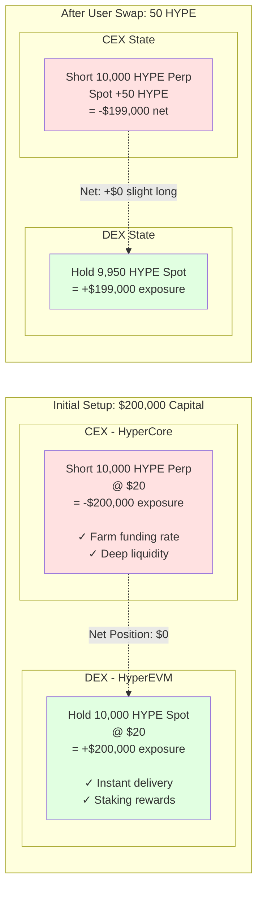

**Key Insight**: Price movements don't affect profit because positions offset each other!

---

## 2. Trading Process Flow

### 2.1 User Swap Execution

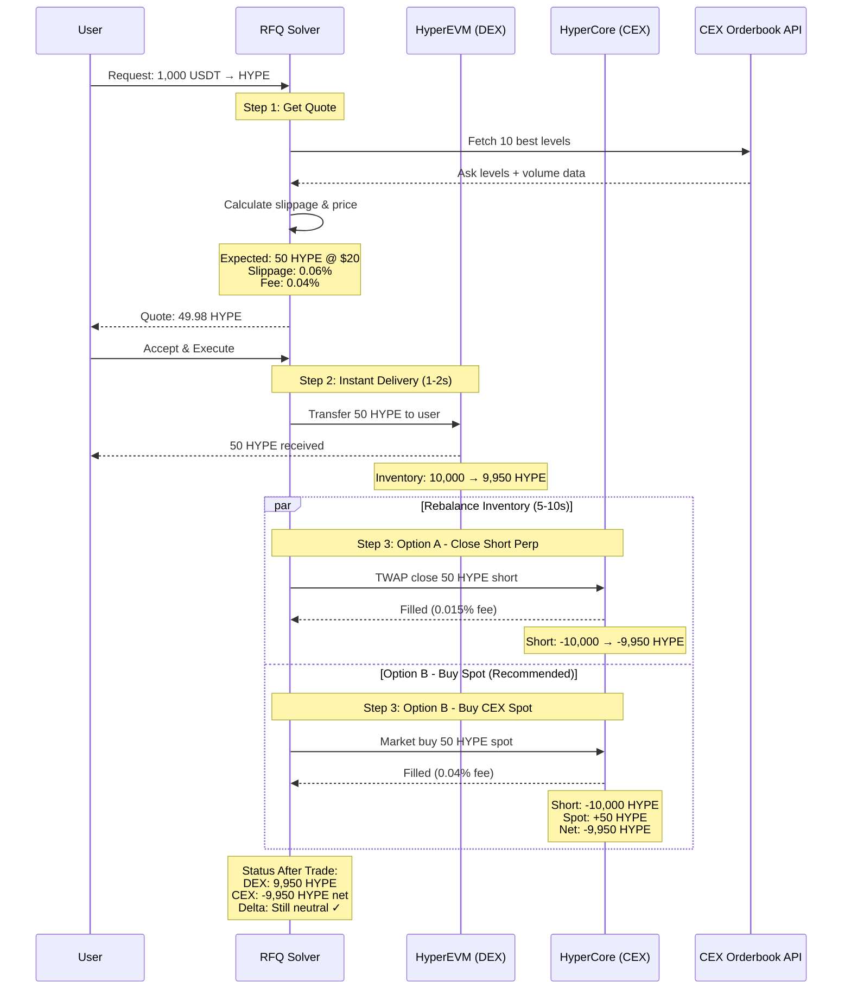

### 2.2 Rebalancing Options Comparison

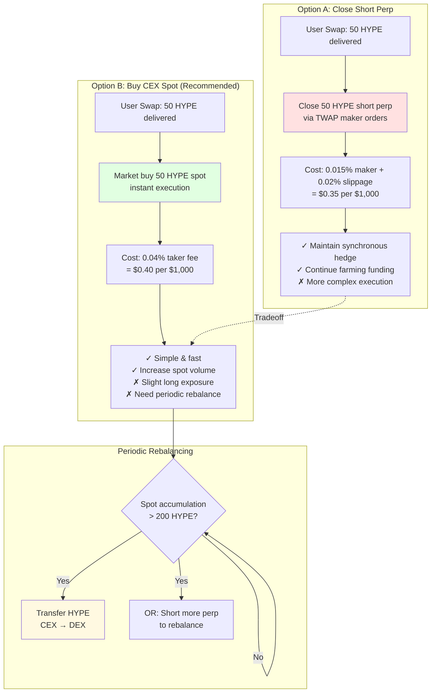

---

## 3. Pricing & Slippage Strategy

### 3.1 Quote Calculation Formula

```mermaid
flowchart TB
    Start[User Request:<br/>$10,000 USDT → HYPE]
    
    subgraph "Input Data Collection"
        OB[Fetch CEX Orderbook<br/>10 best ask levels]
        Vol[Get 1min volume:<br/>$50,000]
        Mid[Calculate mid price:<br/>$20.005]
    end
    
    subgraph "Analysis Phase"
        Est[Estimate HYPE needed:<br/>$10,000 / $20 = 500 HYPE]
        Depth[Calculate depth ratio:<br/>500 / 5,000 = 10%]
        Impact[Determine impact factor:<br/>0.0001 (minimal)]
        VelAdj[Volume velocity adjustment:<br/>50% = 1.2x multiplier]
    end
    
    subgraph "Execution Simulation"
        Walk[Walk through orderbook:<br/>L1: 500 HYPE @ $20.01]
        Avg[Average price:<br/>$10,005 / 500 = $20.01]
        Apply[Apply market impact:<br/>$20.01 × 1.0001 = $20.012]
    end
    
    subgraph "Final Output"
        Output[Output: 499.70 HYPE<br/>Effective Price: $20.012<br/>Slippage: 0.06%]
        Decision{Order size vs<br/>liquidity?}
    end
    
    Start --> OB
    OB --> Vol
    Vol --> Mid
    Mid --> Est
    Est --> Depth
    Depth --> Impact
    Impact --> VelAdj
    VelAdj --> Walk
    Walk --> Avg
    Avg --> Apply
    Apply --> Output
    Output --> Decision
    
    Decision -->|Small: < 10%| Instant[Market Order<br/>Execute immediately]
    Decision -->|Medium: 10-50%| TWAP[TWAP Strategy<br/>7-10 intervals]
    Decision -->|Large: > 50%| Extended[Extended TWAP<br/>15-20 intervals]
    
    style Output fill:#e1ffe1
    style Instant fill:#e1f5ff
    style TWAP fill:#fff9e1
    style Extended fill:#ffe1e1
```

### 3.2 Market Impact Factor Table

| Order Size (% of Liquidity) | Depth Ratio | Base Impact | Volume Adjustment | Final Impact |
|------------------------------|-------------|-------------|-------------------|--------------|
| **< 10%** (Small) | < 0.1 | 0.0001 | 1.0x - 1.2x | **0.01-0.012%** |
| **10-30%** (Medium) | 0.1 - 0.3 | 0.0003 | 1.2x - 1.5x | **0.036-0.045%** |
| **30-50%** (Large) | 0.3 - 0.5 | 0.0010 | 1.2x - 1.5x | **0.12-0.15%** |
| **50-80%** (Very Large) | 0.5 - 0.8 | 0.0025 | 1.0x - 1.5x | **0.25-0.375%** |
| **> 80%** (Extreme) | > 0.8 | 0.0050 | 1.5x - 2.0x | **0.75-1.0%** |

**Volume Velocity Multipliers:**
- Low activity (< 20% velocity): 1.0x
- Normal activity (20-50% velocity): 1.2x
- High activity (> 50% velocity): 1.5x
- Extreme volatility (> 100% velocity): 2.0x

### 3.3 Execution Strategy by Order Size

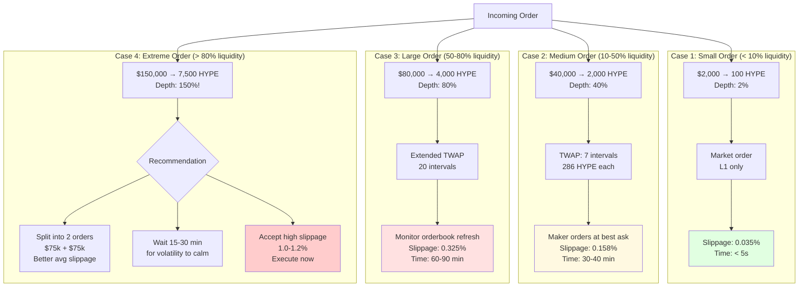

---

## 4. Profit Model & Economics

### 4.1 Revenue Streams (Annual)

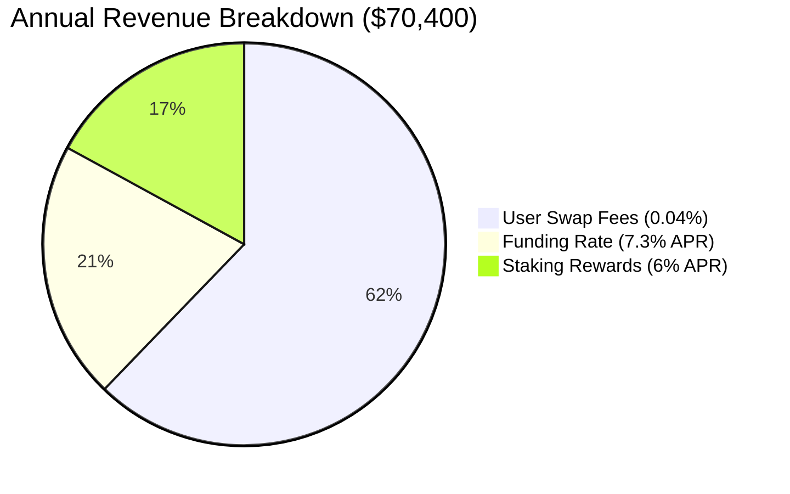

### 4.2 Cost Structure Comparison

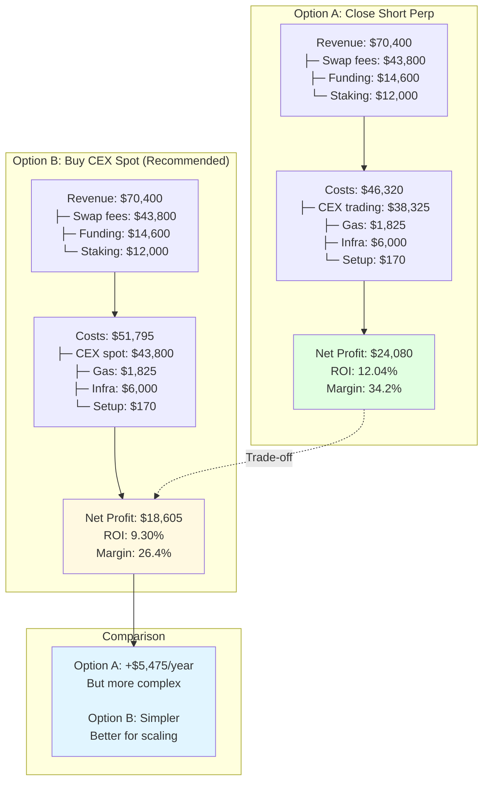

### 4.3 Break-Even Analysis

| Metric | Option A (Close Perp) | Option B (Buy Spot) |
|--------|----------------------|---------------------|
| **Passive Income** | $26,600/year | $26,600/year |
| **Fixed Costs** | $7,995/year | $7,995/year |
| **Trading Costs (variable)** | $38,325/year | $43,800/year |
| **Total Costs** | $46,320/year | $51,795/year |
| **Break-even Volume** | $135,068/day | $172,568/day |
| **Current Volume** | $300,000/day | $300,000/day |
| **Safety Buffer** | **2.22x** | **1.74x** |

**Sensitivity Analysis:**

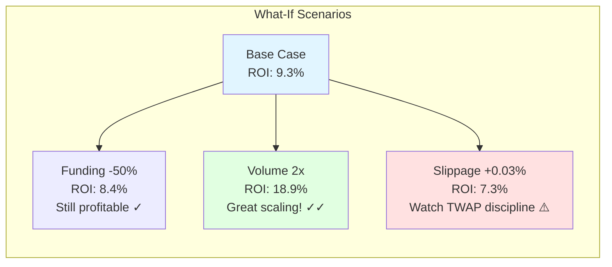

### 4.4 Fee Comparison vs Competition

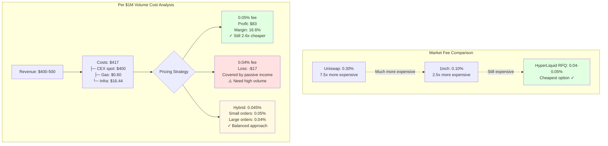

---

## 5. Risk Management Framework

### 5.1 Risk Categories & Mitigation

```mermaid
graph TB
    subgraph "Market Risks"
        R1[Funding Rate Turns Negative<br/>Impact: -$21,900/year]
        M1[Mitigation:<br/>- Reduce short 100% → 70%<br/>- Switch to LP provision<br/>- Accept 30% directional risk]
        R1 --> M1
    end
    
    subgraph "Inventory Risks"
        R2[DEX Inventory Depleted<br/>Impact: Can't fulfill orders]
        M2[Mitigation:<br/>Threshold 1 ≤50%: Raise fees to 0.05%<br/>Threshold 2 ≤30%: Stop new orders<br/>Emergency restock in 1-2 hours]
        R2 --> M2
    end
    
    subgraph "Execution Risks"
        R3[High Slippage on Rebalance<br/>Impact: Reduced margins]
        M3[Mitigation:<br/>- Use TWAP for large trades<br/>- Maker orders when possible<br/>- Monitor orderbook depth]
        R3 --> M3
    end
    
    subgraph "Operational Risks"
        R4[API Downtime / Latency<br/>Impact: Missed opportunities]
        M4[Mitigation:<br/>- Redundant API connections<br/>- Fallback to AMM pricing<br/>- Health monitoring]
        R4 --> M4
    end
    
    subgraph "Liquidation Risks"
        R5[CEX Perp Liquidation<br/>Impact: Loss of hedge]
        M5[Mitigation:<br/>- Maintain 3x collateral<br/>- Automatic margin top-up<br/>- Position size limits]
        R5 --> M5
    end

    style M1 fill:#e1ffe1
    style M2 fill:#e1ffe1
    style M3 fill:#e1ffe1
    style M4 fill:#e1ffe1
    style M5 fill:#e1ffe1
```

### 5.2 Position Limits & Thresholds

| Risk Parameter | Threshold | Action | Priority |
|----------------|-----------|--------|----------|
| **DEX Inventory** | < 50% target | Increase fees to 0.05% | Medium |
| **DEX Inventory** | < 30% target | Stop accepting orders | High |
| **Funding Rate** | Negative > 3 days | Reduce short to 70% | Medium |
| **Daily Loss** | > $500 | Investigate & pause | High |
| **Slippage** | > 0.10% average | Review TWAP execution | Medium |
| **CEX Collateral** | < 200% maintenance | Add margin immediately | Critical |
| **API Latency** | > 500ms | Switch to backup | High |

---

## 6. Implementation Architecture

### 6.1 System Components

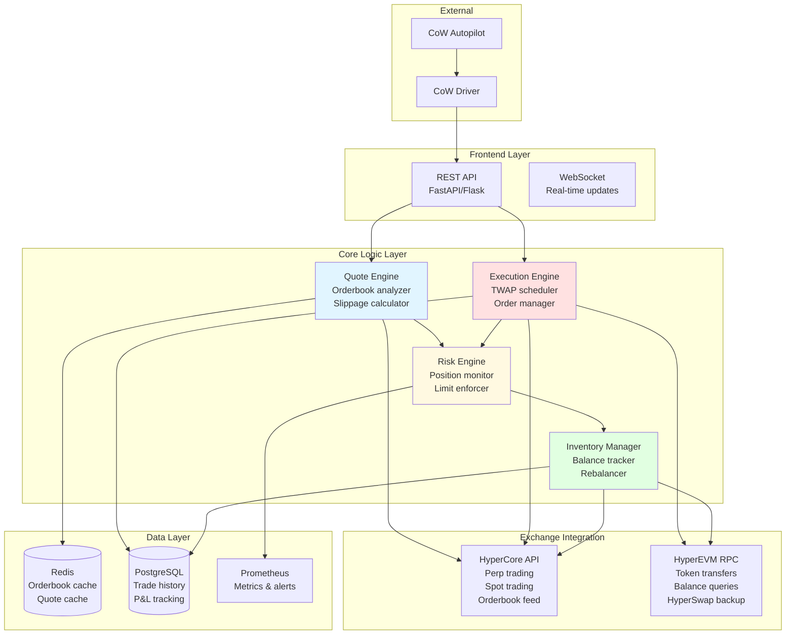

### 6.2 Data Flow

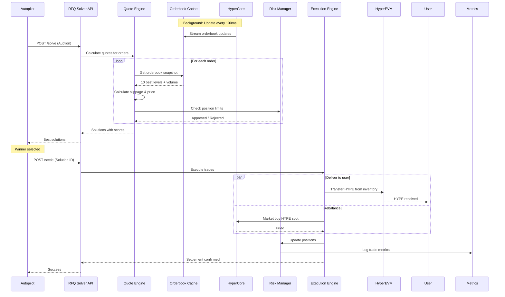

---

## 7. Performance Metrics & Monitoring

### 7.1 Key Performance Indicators

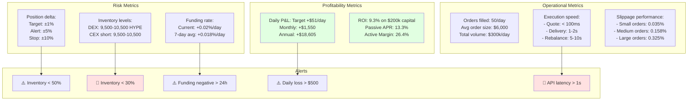

### 7.2 Monitoring Dashboard Layout

**Real-time Metrics:**
- Current positions (DEX spot, CEX perp, CEX spot)
- Today's P&L breakdown
- Funding rate (current, 24h avg, 7d avg)
- Active orders & pending executions
- API latency & health

**Historical Analytics:**
- Daily/weekly/monthly P&L charts
- Volume trends
- Slippage distribution
- Win rate in auctions
- Cost breakdown

---

## 8. Deployment Checklist

### Phase 1: Testing (Week 1-2)
- [ ] Set up testnet accounts on HyperCore & HyperEVM
- [ ] Deploy solver API with logging
- [ ] Integrate with CoW playground
- [ ] Test quote calculations with various order sizes
- [ ] Validate rebalancing logic
- [ ] Stress test with high volume scenarios

### Phase 2: Pilot (Week 3-4)
- [ ] Deploy with $20k capital (10% of target)
- [ ] Enable for small orders only (< $5k)
- [ ] Monitor execution quality
- [ ] Tune slippage parameters
- [ ] Measure actual vs expected P&L
- [ ] Collect performance data

### Phase 3: Scale (Month 2)
- [ ] Increase capital to $100k (50%)
- [ ] Enable medium orders (< $50k)
- [ ] Implement TWAP execution
- [ ] Add advanced risk controls
- [ ] Optimize rebalancing frequency
- [ ] Target $150k daily volume

### Phase 4: Production (Month 3+)
- [ ] Full $200k capital deployment
- [ ] Enable all order sizes
- [ ] Advanced execution strategies
- [ ] Automated rebalancing
- [ ] Target $300k+ daily volume
- [ ] Continuous optimization

---

## 9. Competitive Advantages

| Feature | UniSwap | 1inch | HyperLiquid RFQ |
|---------|---------|-------|-----------------|
| **Fee** | 0.30% | 0.10% | **0.04-0.05%** ✓ |
| **Execution** | AMM | Aggregator | **Inventory** ✓ |
| **Speed** | 12s (1 block) | 12s + routing | **1-2s** ✓ |
| **Slippage** | 0.5-2% | 0.1-0.5% | **0.03-0.3%** ✓ |
| **MEV Risk** | High | Medium | **None** ✓ |
| **Gas Cost** | $5-20 | $10-30 | **$0.10** ✓ |

---

## 10. Next Steps

1. **Review & Validate**: Have your team review this architecture
2. **Set Up Infrastructure**: Deploy monitoring & data pipelines
3. **Build Core Components**: Start with Quote Engine & Inventory Manager
4. **Test Extensively**: Use playground for end-to-end testing
5. **Start Small**: Pilot with limited capital and order sizes
6. **Monitor & Optimize**: Collect data and tune parameters
7. **Scale Gradually**: Increase capital and order limits based on performance

---

## Appendix: Quick Reference

### Revenue Formula (Annual)
```
Revenue = User_Fees + Funding_Rate + Staking_Rewards
        = $43,800  + $14,600      + $12,000
        = $70,400/year
```

### Cost Formula (Annual) - Option B
```
Costs = CEX_Spot_Fees + Gas_Fees + Infrastructure + Setup
      = $43,800       + $1,825    + $6,000         + $170
      = $51,795/year
```

### Net Profit
```
Profit = Revenue - Costs = $70,400 - $51,795 = $18,605
ROI = $18,605 / $200,000 = 9.30%
```

### Break-Even Volume
```
Required_Daily_Volume = (Costs - Passive_Income) / Fee_Rate
                      = ($51,795 - $26,600) / 0.0004
                      = $172,568/day
```

**Current volume: $300,000/day = 1.74x break-even ✓**
